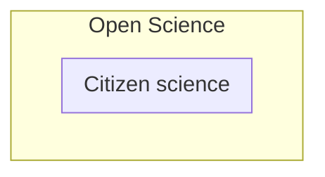
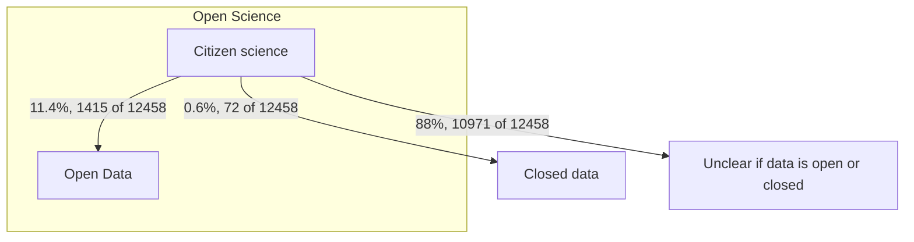
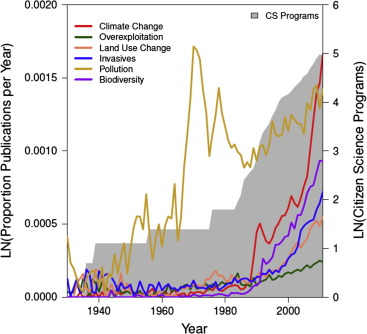
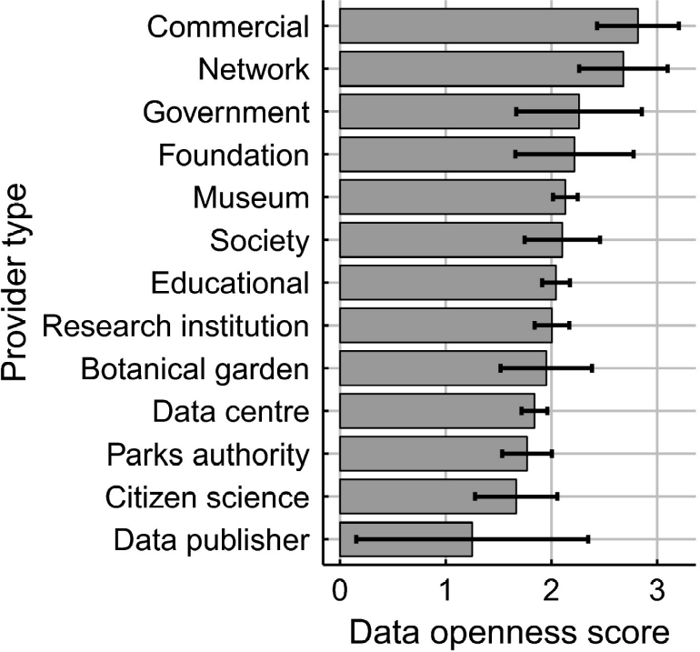

# open_science_presentation_20241108

- Title: Open Science and humans being scientists
- Where: [Open Science Uppsala](https://open-science-uppsala.github.io/open_science_uppsala/content/20241108_richel_bilderbeek/),
  [event page](https://open-science-uppsala.github.io/open_science_uppsala/content/20241108_richel_bilderbeek/)

## Description

The European Union thinks Open Science is important.
One of the facets of its strategic plan is citizen science,
which is using non-scientists in research.
This talk will be about citizen science:
why is citizen science important?
What is its impact?
What evidence do we have for this?
And of course: where and how can a regular citizen help?

## Structure

- What is Open Science?
- What is Citizen Science?

- Relation between the two:

'Open science opens the processes of scientific knowledge creation, evaluation and
communication to societal actors beyond the traditional scientific
community' Source: [UNESCO about Open Science](https://www.unesco.org/en/open-science/about):

- Is all citizen science open science?

No:

- Why is Citizen Science important?
- What is the impact of Citizen Science?
  - Money: around $667 million to $2.5 billion per year for 388 projects [Theobald et al., 2015].
   This equals 1.72M$-6.4M$ per project
  - Money: assuming $12/h wage: average $222,068 per project (of 7 projects), from $22,717-$654,130 [Sauermann & Franzoni, 2015]
  - The majority of citizen science-collected data do not reach peer-reviewed literature [Sauermann & Franzoni, 2015],
    only 12% of reviewed projects listed peer-reviewed scientific publications on their websites and/or returned results in Web of Science searches with project name' [Sauermann & Franzoni, 2015]
  - Compare 61% (open access) + 21% (closed acccess) of projects resulting in a publication `[Hecker et al., 2018]`

- [Sauermann & Franzoni, 2015] Henry Sauermann; Chiara Franzoni (20 January 2015). "Crowd science user contribution patterns and their implications". Proceedings of the National Academy of Sciences of the United States of America. 112 (3): 679–684. Bibcode:2015PNAS..112..679S. doi:10.1073/pnas.1408907112. PMC 4311847. PMID 25561529.
- [Theobald et al., 2015] J. Theobald; A. K. Ettinger; H. K. Burgess; L. B. DeBey; N. R. Schmidt; H. E. Froehlich; C. Wagner; J. HilleRisLambers; J. Tewksbury; M. A. Harsch; J. K. Parrish (1 January 2015). "Global change and local solutions: Tapping the unrealized potential of citizen science for biodiversity research". Biological Conservation. 181 (2015): 236–244. Bibcode:2015BCons.181..236T. doi:10.1016/j.biocon.2014.10.021.

- How to contribute to a citizen science project

- `[Moedas, 2018]` Moedas, Carlos. Citizen science: innovation in open science,
  society and policy. Ucl Press, 2018.
  [Download page](https://www.jstor.org/stable/j.ctv550cf2)
  - Chapter 1: Innovation in open science, society and policy – setting the agenda for citizen science (pp. 1-24)
    Susanne Hecker, Muki Haklay, Anne Bowser, Zen Makuch, Johannes Vogel and Aletta Bonn, 2018.
    [Download](https://www.jstor.org/stable/j.ctv550cf2.8)
  - `[Hecker et al., 2018]` Chapter 13 The European citizen science landscape – a snapshot (pp. 190-200)
    Susanne Hecker, Lisa Garbe and Aletta Bonn, 2018.
    [Download](https://www.jstor.org/stable/j.ctv550cf2.20)
  - Chapter 31 Citizen science to foster innovation in open science, society and policy (pp. 465-484)
    Aletta Bonn, Susanne Hecker, Anne Bowser, Zen Makuch, Johannes Vogel and Muki Haklay, 2018.
    [Download](https://www.jstor.org/stable/j.ctv550cf2.38)

## Definition citizen science

> Citizen science (similar to community science, crowd science, crowd-sourced
> science, civic science, participatory monitoring, or volunteer monitoring)
> is research conducted with participation from the general public, or
> amateur/nonprofessional researchers or participants for science, social
> science and many other disciplines `[Vohland et al., 2021][Gura, 2013]`

References:
    
- `[Vohland et al., 2021]` Katrin Vohland, ed. (2021). The Science of Citizen Science. Cham, Switzerland: Springer. ISBN 978-3-030-58278-4. OCLC 1230459796.
- `[Gura, 2013]` Gura, Trisha (April 2013). "Citizen science: Amateur experts". Nature. 496 (7444): 259–261. doi:10.1038/nj7444-259a. ISSN 1476-4687. PMID 23586092. S2CID 20840626.

Alternatives:

- The participation of nonscientists in the process of gathering data
  according to specific scientific protocols and in the process of using and
  interpreting that data. `[Lewenstein, 2004]`
- The engagement of nonscientists in true decision-making about policy issues
  that have technical or scientific components. `[Lewenstein, 2004]`
- The engagement of research scientists in the democratic and
  policy process. `[Lewenstein, 2004]`

References:

- `[Lewenstein, 2004]` Lewenstein, B. (8 June 2004). "What does citizen science accomplish?". Cornell University. Archived from the original on 9 October 2014. Retrieved 16 September 2014.

Ten Principles of Citizen Science `[ECSA, 2015]`:

- Citizen science projects actively involve citizens in scientific endeavour that generates new knowledge or understanding. Citizens may act as contributors, collaborators, or as project leader and have a meaningful role in the project.
- Citizen science projects have a genuine science outcome. For example, answering a research question or informing conservation action, management decisions or environmental policy.
- Both the professional scientists and the citizen scientists benefit from taking part. Benefits may include the publication of research outputs, learning opportunities, personal enjoyment, social benefits, satisfaction through contributing to scientific evidence e.g. to address local, national and international issues, and through that, the potential to influence policy.
- Citizen scientists may, if they wish, participate in multiple stages of the scientific process. This may include developing the research question, designing the method, gathering and analysing data, and communicating the results.
- Citizen scientists receive feedback from the project. For example, how their data are being used and what the research, policy or societal outcomes are.
- Citizen science is considered a research approach like any other, with limitations and biases that should be considered and controlled for. However unlike traditional research approaches, citizen science provides opportunity for greater public engagement and democratisation of science.
- Citizen science project data and meta-data are made publicly available and where possible, results are published in an open access format. Data sharing may occur during or after the project, unless there are security or privacy concerns that prevent this.
- Citizen scientists are acknowledged in project results and publications.
- Citizen science programmes are evaluated for their scientific output, data quality, participant experience and wider societal or policy impact.
- The leaders of citizen science projects take into consideration legal and ethical issues surrounding copyright, intellectual property, data sharing agreements, confidentiality, attribution, and the environmental impact of any activities.

References:

- `[ECSA, 2015]` European Citizen Science Association (September 2015). "10 Principles of Citizen Science (English)" (PDF). ECSA. Archived (PDF) from the original on 22 August 2016. Retrieved 18 August 2016.

## Demographics

The demographics of participants in citizen science projects are overwhelmingly
White adults, of above-average income, having a university
degree. `[Cooper et al., 2023]` Other groups of volunteers include
conservationists, outdoor enthusiasts, and amateur scientists.
As such, citizen scientists are generally individuals with a
pre-understanding of the scientific method and how to conduct sensible
and just scientific analysis.

References:

- `[Cooper et al., 2023]` Cooper, Caren B. et al. "Inclusion in
  citizen science: The conundrum of rebranding." Science 25 June 2021.
  Vol. 372, Issue 6549, pp. 1386–1388.
  doi:10.1126/science.abi6487 accessed 18 April 2023

From [UNESCO about Open Science](https://www.unesco.org/en/open-science/about):

> Open science is a set of principles and practices that aim to make scientific
> research from all fields accessible to everyone for the benefits of
> scientists and society as a whole. Open science is about making sure not
> only that scientific knowledge is accessible but also that the production of
> that knowledge itself is inclusive, equitable and sustainable.
> [...]
> Open science has the potential of making the scientific process more
> transparent, inclusive and democratic. 
>
> Open science:
> - [...]
> - [...]
> - opens the processes of scientific knowledge creation, evaluation and
>   communication to societal actors beyond the traditional scientific
>   community.

European Citizen Science Association: [https://ecsa.citizen-science.net/working-groups/citizen-science-and-open-science/](https://ecsa.citizen-science.net/working-groups/citizen-science-and-open-science/)

Not always does Citizen Science lead to open data,
even though the volunteers expect that [Groom et al., 2017]

Also from [Groom et al., 2017] fig 2:

Interpreted intention of the licence                   | Data openness score | Number of data sets
------------------------------------------------------ | ------------------- | -------------------
Requires permission to use                             | 0                   | 72                 
Non-commercial usage, with attribution and share alike | 1                   | 38                 
With attribution and share alike                       | 1                   | 1                  
Non-commercial usage                                   | 1                   | 16                 
Non-commercial usage, with attribution                 | 1                   | 322                
With attribution                                       | 2                   | 492                
Public domain                                          | 3                   | 546                
Not specified or ambiguous                             | .                   | 10 971             

> Groom et al., 2017 figure 1.

## Examples

- [List of citizen science project](https://en.wikipedia.org/wiki/List_of_citizen_science_projects)

## References

- [Groom et al., 2017] Groom, Quentin, Lauren Weatherdon, and Ilse R. Geijzendorffer. "Is citizen science an open science in the case of biodiversity observations?." Journal of Applied Ecology 54.2 (2017): 612-617. [Online](https://besjournals.onlinelibrary.wiley.com/doi/10.1111/1365-2664.12767)
